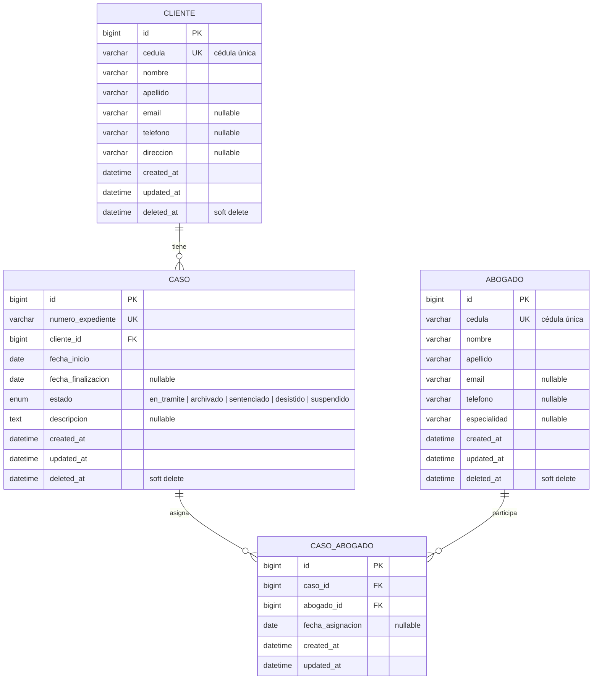

# bufete-abogados

## 📌 Tabla de Contenidos

- [Características](#-características)
- [Tecnologías](#-tecnologías)
- [Diagrama de Base de Datos](#-diagrama-de-base-de-datos)
- [Instalación con Docker](#-instalación-con-docker)
- [Credenciales de demostración](#-credenciales-de-demostración)
- [Autenticación (interfaz web)](#-autenticación-interfaz-web)
- [Documentación de la API (Swagger)](#-documentación-de-la-api-swagger)
- [Endpoints de la API](#-endpoints-de-la-api)
- [Exportación a Excel](#-exportación-a-excel)
- [Script SQL y consultas](#-script-sql-y-consultas)
- [Pruebas y estilo de código](#-pruebas-y-estilo-de-código)
- [Estructura del proyecto](#-estructura-del-proyecto)
- [Recursos web](#-recursos-web)
- [Solución de problemas](#-solución-de-problemas)
- [Autor](#-autor)

## 🌟 Características

- **CRUD completo** de clientes, abogados y casos en **web y API**
- **Autenticación dual**: sesión web y tokens **Bearer** (Laravel Sanctum)
- **Relación N:M** entre casos y abogados con tabla pivote y fecha de asignación
- **Protección anti-eliminación** en dos capas (triggers SQL + SoftDeletes)
- **Validación robusta** de datos y estados tipados con PHP enums
- **Documentación interactiva** de la API (Swagger UI + colección Postman)
- **Exportación a Excel** con una hoja independiente por abogado
- **Dockerizado** para desarrollo reproducible (app + nginx + mysql)

## 🛠 Tecnologías

| Capa             | Tecnología                                                    |
|------------------|---------------------------------------------------------------|
| **Backend**      | Laravel 13 (PHP 8.4)                                          |
| **Base de datos**| MySQL 8.4 (LTS)                                               |
| **Frontend**     | Blade + Tailwind CSS 4 (Vite)                                 |
| **Autenticación**| Laravel Sanctum (tokens API) + sesión web                     |
| **Documentación**| Swagger UI (OpenAPI 3.0) + Postman                         |
| **Exportación**  | Maatwebsite/Laravel-Excel                                     |
| **Entorno**      | Docker + Docker Compose (app, nginx, mysql)                   |
| **Pruebas**      | PHPUnit (PHP 12) + Pest disponible                             |

## 🗄 Diagrama de Base de Datos



| Tabla          | Descripción                                 |
|----------------|---------------------------------------------|
| `clientes`     | Datos personales del cliente (cédula única) |
| `abogados`     | Datos personales del abogado (cédula única) |
| `casos`        | Expediente, período, estado y cliente       |
| `caso_abogado` | Relación N:M caso ↔ abogado (pivote)        |

### Relaciones del modelo

| Modelo   | Relación              | Tipo       | Tabla pivote    |
|----------|-----------------------|------------|-----------------|
| `Cliente`| `casos()`             | 1 → N      | —               |
| `Caso`   | `cliente()`           | N → 1      | —               |
| `Caso`   | `abogados()`          | N ↔ N      | `caso_abogado`  |
| `Abogado`| `casos()`             | N ↔ N      | `caso_abogado`  |

### No se puede eliminar ningún registro

La protección se implementa en dos capas:

1. **Nivel base de datos** — `database/sql/bufete_abogados.sql` define triggers `BEFORE DELETE` que lanzan `SIGNAL SQLSTATE '45000'` y bloquean la eliminación física de cualquier fila.
2. **Nivel aplicación** — todos los modelos usan `SoftDeletes` (`deleted_at`); los registros solo se marcan como eliminados.

## 🚀 Instalación con Docker

### Requisitos previos

- Docker Engine 24+ y Docker Compose v2
- (Opcional) PHP 8.3+ y Composer 2 para desarrollo fuera de Docker

### Pasos de configuración

```bash
# 1. Copiar configuración
cp .env.example .env

# 2. Construir y levantar los contenedores
docker compose up -d --build

# 3. Instalar dependencias y generar APP_KEY
docker compose exec app composer install --no-interaction
docker compose exec app php artisan key:generate

# 4. Migraciones y datos de demostración
docker compose exec app php artisan migrate --seed

# 5. Compilar assets del frontend (Vite)
npm install
npm run build
```

La aplicación queda disponible en **http://localhost:8080**.

> Nota: `docker-compose.yml` expone MySQL en el puerto `33061` del host para evitar conflictos con instalaciones locales.

## 🔑 Credenciales de demostración

| Campo    | Valor             |
|----------|-------------------|
| Email    | `demo@bufete.com` |
| Password | `password`        |

## 🔐 Autenticación (interfaz web)

El sistema requiere iniciar sesión para acceder a cualquier módulo.

| Ruta        | Método   | Descripción                    |
|-------------|----------|--------------------------------|
| `/register` | GET/POST | Registro de un nuevo usuario   |
| `/login`    | GET/POST | Inicio de sesión               |
| `/logout`   | POST     | Cierre de sesión               |

## 📚 Documentación de la API (Swagger)

La API se documenta con **Swagger** mediante una interfaz interactiva y una colección de **Postman** portable en la carpeta `docs/`.

### Documentación en la carpeta `docs/`

```
docs/
├── README.md                            # índice de la documentación
└── postman/
    └── bufete_abogados.postman_collection.json   # Colección Postman v2.1
```

La colección incluye **todas las peticiones de la API** (login, register, logout y CRUD de clientes, abogados y casos). Para importarla: **Postman → Import → Upload Files** y selecciona `docs/postman/bufete_abogados.postman_collection.json`.

### Documentación Swagger interactiva

| Recurso    | URL                               |
|------------|-----------------------------------|
| Swagger UI | `http://localhost:8080/docs`      |
| Postman    | `http://localhost:8080/docs.postman` |

La especificación que alimenta la interfaz Swagger se mantiene en `public/swagger.json`.
Si cambia la API, hay que actualizar ese archivo para reflejar los cambios.

## 📡 Endpoints de la API

### Autenticación (Bearer Token)

```
POST /api/login
Content-Type: application/json

{ "email": "demo@bufete.com", "password": "password" }
```

Respuesta:

```json
{
  "message": "Autenticación exitosa.",
  "token": "1|i3t1HXF2ntGL6H2aXxcHG3tsPOiDuCEVybmbHzYf7316ee3c",
  "token_type": "Bearer",
  "user": { "id": 1, "name": "Usuario Demo", "email": "demo@bufete.com" }
}
```

También se puede registrar un nuevo usuario (`POST /api/register`), que devuelve un token listo para usar, y cerrar sesión (`POST /api/logout`), que revoca el token actual.

### 🔐 Autenticación

| Método | Endpoint         | Descripción                      |
|--------|------------------|----------------------------------|
| POST   | `/api/register`  | Registro de usuario (devuelve token) |
| POST   | `/api/login`     | Inicio de sesión (devuelve token)    |
| POST   | `/api/logout`    | Cierra sesión y revoca el token  |
| GET    | `/api/user`      | Obtiene el usuario autenticado   |

### 👤 Clientes

| Método | Endpoint              | Descripción              |
|--------|-----------------------|--------------------------|
| GET    | `/api/clientes`       | Lista clientes           |
| POST   | `/api/clientes`       | Crea un cliente          |
| GET    | `/api/clientes/{id}`  | Muestra un cliente       |
| PUT    | `/api/clientes/{id}`  | Actualiza un cliente     |
| DELETE | `/api/clientes/{id}`  | Elimina un cliente (soft delete) |

### ⚖️ Abogados

| Método | Endpoint              | Descripción              |
|--------|-----------------------|--------------------------|
| GET    | `/api/abogados`       | Lista abogados           |
| POST   | `/api/abogados`       | Crea un abogado          |
| GET    | `/api/abogados/{id}`  | Muestra un abogado       |
| PUT    | `/api/abogados/{id}`  | Actualiza un abogado     |
| DELETE | `/api/abogados/{id}`  | Elimina un abogado (soft delete) |

### 📁 Casos

| Método | Endpoint            | Descripción                          |
|--------|---------------------|--------------------------------------|
| GET    | `/api/casos`        | Lista casos                          |
| POST   | `/api/casos`        | Crea un caso (acepta `abogados[]`)   |
| GET    | `/api/casos/{id}`   | Información completa del caso        |
| PUT    | `/api/casos/{id}`   | Actualiza un caso y sus abogados     |
| DELETE | `/api/casos/{id}`   | Elimina un caso (soft delete)        |

> Todos los endpoints requieren `Authorization: Bearer <token>`.

### Obtener toda la información de un caso por su id

```
GET /api/casos/{id}
Authorization: Bearer <token>
Accept: application/json
```

| Código | Caso                                    |
|--------|-----------------------------------------|
| `200`  | Información completa del caso (cliente + abogados) |
| `401`  | Token ausente o inválido                |
| `404`  | El caso no existe                       |

```json
{
  "data": {
    "id": 1,
    "numero_expediente": "EXP-2024-0001",
    "estado": { "value": "en_tramite", "label": "En trámite" },
    "fecha_inicio": "2024-01-15",
    "fecha_finalizacion": null,
    "descripcion": "Demanda civil por incumplimiento de contrato",
    "cliente": { "id": 1, "cedula": "1012345678", "nombre": "Carlos", "apellido": "Gómez" },
    "abogados": [
      { "id": 1, "cedula": "2011112222", "nombre": "Juan", "apellido": "Pérez", "fecha_asignacion": "2024-01-15" }
    ]
  }
}
```

### 💡 Ejemplos de uso con curl

```bash
# Login y obtención de token
curl -X POST http://localhost:8080/api/login \
  -H "Content-Type: application/json" \
  -d '{"email":"demo@bufete.com","password":"password"}'

# Crear un caso
curl -X POST http://localhost:8080/api/casos \
  -H "Authorization: Bearer <token>" \
  -H "Accept: application/json" \
  -H "Content-Type: application/json" \
  -d '{
    "numero_expediente": "EXP-2024-0002",
    "cliente_id": 1,
    "fecha_inicio": "2024-02-01",
    "estado": "en_tramite",
    "descripcion": "Caso de ejemplo",
    "abogados": [1, 2]
  }'

# Detalle completo de un caso
curl http://localhost:8080/api/casos/1 \
  -H "Authorization: Bearer <token>" \
  -H "Accept: application/json"
```

## 📊 Exportación a Excel

Genera un libro con **una hoja independiente por abogado**; cada hoja contiene los clientes y sus casos (expediente, cliente, cédula, estado, fechas y abogados del caso).

```bash
docker compose exec app php artisan casos:export
```

Resultado: `storage/app/private/casos_por_abogado.xlsx`

También se puede descargar desde la interfaz web (botón *Exportar Excel* en la barra de navegación).

## 🗃 Script SQL y consultas

El archivo `database/sql/bufete_abogados.sql` contiene:

1. Esquema completo (tablas, índices, FKs, triggers anti-eliminación).
2. Datos de demostración (5 clientes, 4 abogados, 10 casos, relaciones N:M).
3. Las tres consultas solicitadas:

```sql
-- Casos asociados a un cliente según su cédula
SELECT c.numero_expediente, c.estado, c.fecha_inicio, c.fecha_finalizacion,
       cl.cedula, CONCAT(cl.nombre, ' ', cl.apellido) AS cliente
FROM casos c
INNER JOIN clientes cl ON cl.id = c.cliente_id
WHERE cl.cedula = '1012345678'
ORDER BY c.numero_expediente;

-- Todos los casos en orden ascendente
SELECT * FROM casos ORDER BY numero_expediente ASC;

-- Los 5 (cinco) primeros registros
SELECT * FROM casos ORDER BY id ASC LIMIT 5;
```

## ✅ Pruebas y estilo de código

```bash
# Pruebas
docker compose exec app php artisan test

# Estilo de código (Pint)
docker compose exec app ./vendor/bin/pint
```

Las pruebas cubren: autenticación web (login, registro, logout, rutas protegidas) y de la API (login, register, logout, 401), CRUD completo de clientes/abogados/casos en web y API (incluyendo validaciones y soft delete), recurso de caso (200/401/404) y generación del Excel con una hoja por abogado.

## 📂 Estructura del proyecto

```
app/
├── Console/Commands/ExportarCasosCommand.php   # php artisan casos:export
├── Enums/CasoEstado.php                        # estados del caso
├── Exports/                                    # exportaciones Excel
│   ├── CasosPorAbogadoExport.php               # libro multi-hoja
│   └── Sheets/CasosDeAbogadoSheet.php          # hoja por abogado
├── Http/
│   ├── Controllers/Auth/                       # login/registro/logout web
│   ├── Controllers/Api/                        # Auth, Cliente, Abogado, Caso
│   ├── Controllers/                            # Dashboard, Cliente, Abogado, CasoWeb, Export
│   ├── Requests/                               # validaciones de formularios
│   └── Resources/                              # CasoResource, ClienteResource, AbogadoResource
├── Models/                                     # Cliente, Abogado, Caso, CasoAbogado, User
└── Services/                                   # AuthService, ClienteService, AbogadoService, CasoService
public/swagger.json                             # especificación que alimenta Swagger UI
public/vendor/swagger-ui/                       # assets de la interfaz Swagger UI
docs/                                           # documentación (colección Postman)
database/
├── migrations/                                 # esquema (clientes, abogados, casos, caso_abogado)
├── seeders/                                    # datos de demostración
└── sql/bufete_abogados.sql                     # script SQL solicitado en la prueba
docker/nginx/default.conf                       # configuración de nginx
Dockerfile                                      # imagen php:8.4-fpm-alpine
docker-compose.yml                              # app + nginx + mysql
```

## 🖥 Recursos web

| Ruta            | Descripción                           |
|-----------------|---------------------------------------|
| `/`             | Dashboard con indicadores             |
| `/clientes`     | CRUD de clientes                      |
| `/abogados`     | CRUD de abogados                      |
| `/casos`        | CRUD de casos (orden ascendente)      |
| `/casos/{id}`   | Detalle del caso                      |
| `/exportar-excel` | Descarga el libro Excel             |

## 🐛 Solución de problemas

1. **Error de conexión a la base de datos**:
   - Verificar que MySQL esté sano: `docker compose ps`
   - Revisar logs con `docker compose logs db`
   - Comprobar que el puerto host `33061` esté libre

2. **Problemas al compilar assets**:
   - Borrar `node_modules` y reinstalar: `npm clean-install`
   - Ejecutar `npm run build` tras cualquier cambio en Vite

3. **Migraciones fallidas**:
   ```bash
   docker compose exec app php artisan migrate:fresh --seed
   ```

4. **Documentación desactualizada**:
   Actualizar `public/swagger.json` cuando cambien los endpoints de la API.

## 👤 Autor

**Duvan Gamboa**

- LinkedIn: [Duvan Gamboa](https://www.linkedin.com/in/duvan-gamboa-5193951b2/)
- Email: [info@duvangamboa.dev](mailto:info@duvangamboa.dev)
- Web: [https://duvangamboa.dev](https://duvangamboa.dev)
